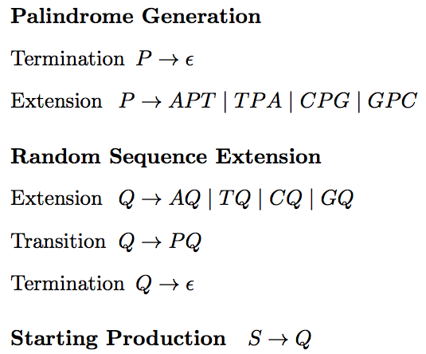
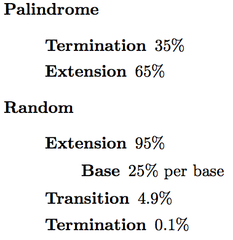

#Palindrome PCFG#
##Generation and Annotation of DNA Embedded Palindromes##

###Overview###
Palindromes have very special signifigance in DNA sequences. Recall that in English language, a palindrome is a word or series of words that reads the same direction forwards and backwards. That is, the characters form a mirror image. 

In a DNA sequence, a palindrome is not a sequence of mirrored characters but instead a sequence for which the reverse complement of the sequence reads the same as the sequence. That is, reading the sequence in the 5' to 3' direction and the sequences complementary strand in the 3' to 5' direction is exactly the same.

First, recall the rules of DNA base pairing. There are 4 nucleotide bases A,T,C and G and each pairs with its complement in the following manner

>		A-T
>		T-A
>		G-C
>		C-G

Following these rules, a simple example of a DNA palindrome would be

>		ATCGAT
>		TAGCTA

Notice that reading the top strand and bottom strand of the above example in reverse directions is the same.

###Motivation###
Palindromes in DNA serve many purposes. Smaller palindromes serve as restriction sites where restriction enzymes can bind and sheer the DNA in two. Larger palindromes are the remenants of inverted duplications, where a long segment of DNA is replicated and spliced back into the genome in reverse orientation.

It's quite clear that Palindromes are of biological interest, but there are two seminal problems when in comes to computation work with palindromes. The first is the development of probabilistic model for the random generation of palindromes. The second is the use of the probabilistic model to annotate DNA sequences to identify palindromes that are statistically significant according to the provided model.

###Approach###
A common approach to this problem is the use of a Probabilistic Context Free Grammar for the generation and annotation of DNA sequences embedded with palindromes.
Context Free Grammars consist of a set of nonterminals and terminals that are combined together into a set of productions. This grammar consists of the nonterminals P and Q and the terminals A,T,G,C. The grammar is composed as follows.

In combination with the above grammar, a probabilistic component is necessary to model the probabilistic characteristics of palindromes. The key characteristic modeled was the expected length of the palindromes, which should be about 4-8 base pairs to match the length of restriction sites. This was achieved with a geometric distribution, where the first 'success' was defined as the termination of the palindrome. This probability necessarily needed to exceed the probability that a palindrome would be created by chance alone. The following probabilities captured these desired relationships.

###Usage###
Two algorithms for this CFG are coded in Java. The first is for the production of random strings following the grammar and probabilities defined above. The second is for the annotation using the CYK algorithm to parse and produce the most likely parse tree for input sequences.
Code can be compiled on OS X and Linux using the provided bash script.

>		$ ./compile #compile code to src directory
>		$ ./generate #generate random DNA embedded with palindromes
>		$ ./parse <INPUT> #parse input sequence

The `./generate` command returns generated text to standard out. The `./parse` command generates a JSON file in the main repository directory called `data.json`. Opening either `explore.html` or `visualize.html` will produce a visualization of the most likely parse tree. `visualize.html` shows a static parse tree with palindromes highlighted in red. This is useful for seeing the output text in order. `visualize.html` shows the parse tree in a moveable map that can be expanded and contracted. Palindromes can be seen as spurs off of the main tree. This is useful for viewing large parse trees. Neither of these visualizations are particularly useful at the moment for extremely large parse trees. However the JSON file can still be used for further analysis.